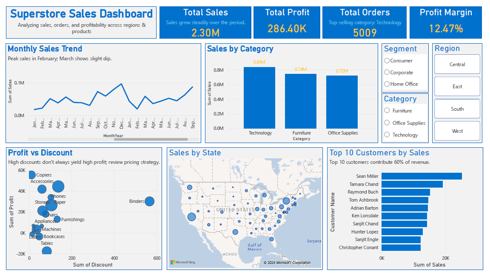

# Retail Sales Executive Dashboard

## Dashboard Preview

## Overview
This project is an interactive Power BI dashboard analyzing the Superstore dataset.  
It provides actionable insights into sales, profitability, and customer behavior to support business decisions.

## Objectives
- Provide **high-level KPIs**: Total Sales, Total Profit, Total Orders, Profit Margin
- Monitor **sales trends over time**
- Identify **top-performing categories and customers**
- Analyze **profitability and discounts**
- Enable **interactive filtering** by Region, Segment, Category, and Ship Mode

## Key Visuals
- KPI Cards: Total Sales, Profit, Orders, Profit Margin
- Monthly Sales Trend (Line Chart)
- Sales by Category (Bar Chart)
- Profit vs Discount (Scatter Plot)
- Sales by Region (Map)
- Top 10 Customers (Bar Chart)
- Slicers for interactivity

## Dashboard Features
### Time Analysis
- Monthly sales trend to identify seasonal patterns  
- Year-over-year comparison  

### Product Analysis
- Sales by category  
- Top-performing products  

### Regional Analysis
- Sales distribution by region and city  
- Interactive map for geographic insights  

### Profitability
- Profit vs Discount scatter plot  
- Profit by category  

### Customer Analysis
- Sales by customer segment  
- Top 10 customers by revenue  

## Insights
- Technology category generates the highest profit  
- High discounts often reduce profitability  
- Certain regions outperform others in sales  
- Seasonal peaks observed during specific months  
- Top 10 customers contribute a significant portion of revenue 

## Tools
- Power BI Desktop
- CSV dataset

## Files Included
- `superstore_dashboard.pbix` – Power BI file  
- `superstore.png` – dashboard preview screenshot
